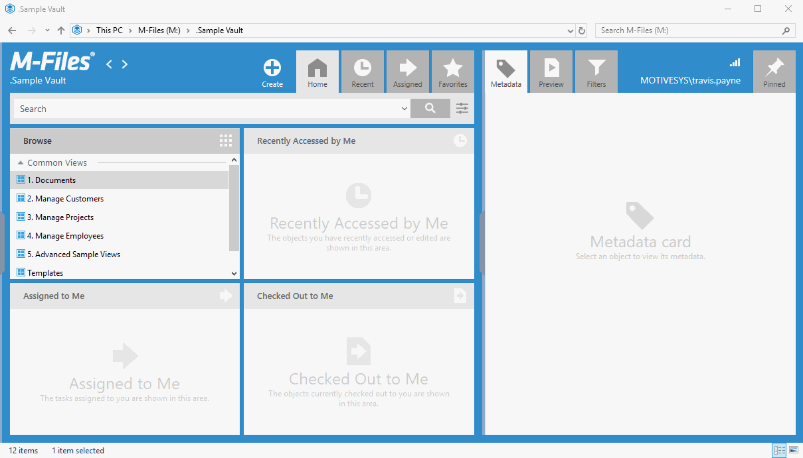

# ShellUI React / TypeScript UX-App

## About
This boilerplate package was originally taken from the [`Jive`](https://git.motivesys.com/ux-apps/jive) application that @heijoe originally developed as a stand-alone application.

This repo however, contains a much more stripped down version of that original work.

The intent for this package is to be used as more of a boilerplate / quick-start base application.


## Quick Start

### `#TEMPLATED_TODO`

The `#TEMPLATED_TODO` tag is located in several locations throughout this project.  These are located in sections of the base application that should be modified when this base is used to create your own application.

So after cloning this repo for use with your own application, be sure to search all sources for this tag and update the placeholder values with you own.

- As a `#RoadMap` item, these templated todo's should likely be updated automatically via a `yeoman` template generator ( or similar ).


### NodeJS
This application is developed in a `node` environment. Before you begin using this package [please ensure you have `node` correctly installed](https://www.wikihow.com/Install-Node.Js-on-Windows) before attempting to build the application.

### Installing Dependencies (NPM)
This application uses `npm` for installing the needed dependencies. After checking out the sources, run the following command from the root folder:

```bash
$ npm install
```


### Building (Gulp)

This application uses `gulp`, `webpack` and `TypeScript` transpilers for building the application. 

Gulp has predefined tasks for most developer needs.

__NOTE:__ If using Node.js version 17 or newer, you might run into the following error:

`Error: error:0308010C:digital envelope routines::unsupported`

This comes from the Webpack v4 we are forced to use (see below). This _should_ not occur if using gulp since we are redefining `crypto.createHash` in webpack configuration files.
If it still occurs however, you can either:
- Downgrade to Node.js 16
- Declare the following environment variable: `NODE_OPTIONS=--openssl-legacy-provider`
- Create a VS Code Workspace for the project and add the following lines to the `code-workspace` file:

      {
        "settings": {
          "terminal.integrated.env.windows": {
            "NODE_OPTIONS": "--openssl-legacy-provider"
          }
        }
      }
For more info, see: https://stackoverflow.com/q/69692842/1288184

#### Supported Gulp Commands

**Watch**: Running gulp without any arguments will build the application, and monitor the source files for changes.  This will result in an automatic rebuild of the application when necessary.

```bash
$ gulp
```

---

**Build**: Builds the application into the `/dist` folder.

```bash
$ gulp build
```

---

**Clean**: Empties the contents of the `/dist` folder.

```bash
$ gulp clean
```

---

**Clear Build**: Empties the contents of the `/dist` folder, then rebuilds the application.

```bash
$ gulp clean-build
```

---

**Package**: Creates a clean build, and then packages the `/dist` folder as an mfappx application in `/package`.

```bash
$ gulp package
```


### Commands to get started

The commands below will: clone the repo / install dependencies / package the mfappx / open the package directory in explorer.

```bash
$ git clone https://github.com/M-Files/UI.Template.TypeScript-React.git
$ cd shellui-react-ts-base
$ npm install
$ gulp package
$ cd package
$ explorer .
```

After this, you can install the application right away to see it in action.




### #ProTip

When active development is ongoing, it is a hassle to make changes and re-install.  Instead you should create a junction point from your `%ProgramFiles%\%MFilesVersion%\Client\Apps\sysapps\your_app_name\` directory that points to the `/dist` directory of the development repo.

---

This can be done using the following command ( running the command prompt as Administrator ):

```bash
$ mklink /J "%ProgramFiles%\M-Files\%MfilesVersion%\Client\Apps\sysapps\your_app_name" "C:\GIT\shellui-react-ts-base\dist"
```

**Note:** Please be sure to replace the `your_app_name` with your actual app name and ensure the proper path to the `dist` folder is used as well.


## Limitations

- In M-Files Desktop __application modules__ (shellUI, vaultUI) the flavor of JavaScript is JScript and it is run in the Windows Scripting Host (WSH) environment
- In M-Files Desktop __dashboards__ the JavaScript is run with the Internet Explorer JavaScript engine
- Both WSH and Internet Explorer provide a rather old version of JavaScript, this leads to the following limitations
  - You'll need to use polyfills, shims and shams where needed
  - Webpack 4 is the latest version of webpack that still makes bundles that work in M-Files Desktop - _do not update to Webpack 5_
  - If using MUI (Material UI), use __[Material-UI v4](https://v4.mui.com/)__ as v5 does not work correctly
  - Other UI component libraries might not work correctly (Bootstrap for example)


## Linting & typing errors
- The compile time error checking is done by the TypeScript compiler
  - Note that the code might still compile even if there are typing errors
- To get more strict error checking you can experiment with the following options in tsconfig.json under compilerOptions
  - "strict": true,
  - "strictNullChecks": true,
  - "noImplicitThis": true,
  - "noImplicitReturns": true,
  - "noUnusedLocals": false,
  - "noUnusedParameters": false,
  - "strictFunctionTypes": true,
  - "strictPropertyInitialization": true,
- In addition to the compile time error checking, the ESLint should show errors and warnings when `gulp lint` is run
- Both TypeScript compiler and ESLint should show errors real time in Visual Studio Code